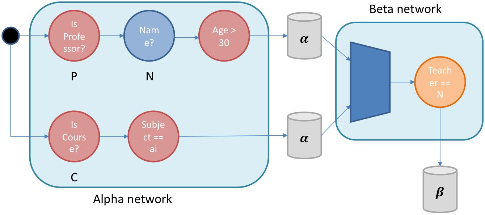

<script type="text/javascript" src="http://cdn.mathjax.org/mathjax/latest/MathJax.js?config=TeX-AMS-MML_HTMLorMML"></script>
<script type="text/x-mathjax-config"> MathJax.Hub.Config({ tex2jax: {inlineMath: [['$', '$']]}, messageStyle: "none" });</script>

# Forward Reasoning
`Automating processes`.

## 1. Introduction
According to what we are looking for, we have a different types of knowledge and ways to represent them. 

So far we have seen many examples of **backward chaining**: starting from the consequences of a rule, we look for the premises in order to prove it.

### Example 

Given the knowledge base:

```prolog
p(X) :- q(X), r(X).
q(1).
r(1).

?- p(X).
   Yes X = 1.
```

The resolution process of the rule `p(X)` starts from the head of the clause and then it moves to the body of the same clause. The final result is true if and only if it's possible to prove the body of the rule.

`Starting from the consequence we look for the premises`.

#

Backward chaining is fine for a **static knowledge**, expecially when we need to reason about goal-oriented problems. However, it's not a feasible solution for real system applications, since the knowledge base changes continuosly.

A possible work-around could be: add new informations inside the storage and restart the reasoning. By the way, this is not really possible when we are dealing with a huge code base.

We would like to have a sort of knowledge base in which we can add **dynamically** new facts. This is achieved **rules** by the notion of **rule**.

## 2. Rules
There exists another mental constructor that we as humans being make so much use, named **rules**. Rules are a very common way for explaining knowledge and sometimes parts of it are easier to represent by them.

In addition, rules allow us to add dynamically new facts inside the knowledge base.

In contrast to backward chaining, rules adopt **forward chaining**: from the premises we try to prove the consequences.

### Example
The previous query can be written following forward chaining:
```
p(X) :- q(X), r(X).

↓

p(X) ← q(X), r(X).

↓

q(X), r(X) → p(X).
```

#

The simplest form of a rule is the logical implication:
$$p_1, ..., p_i \rightarrow q_1, ..., q_j$$
- $p_1, ..., p_i$ are called the **premises** or the **Left Hand Side** (LHS).
- $q_1, ..., q_j$ are called the **consequences** or the **Right Hand Side** (RHS).

## 3. Production rules systems
Our goal is to define a rules system, based on forward chaning, that guarantees the dynamical addition of new facts within the knowledge base. This is possible by the **production rules approach**.

In the production rules approach, new facts can be added dynamically to the knowledge base, also called **working memory** (WM). If new facts match with the left hand side of any other rule, the whole mechanism is **triggered**, until it reaches **quiescence** again.

The right hand side are the effects of the rules that could influence the external world and the knowledge base itself. A side effect might be: 
- 1<sup>st</sup>. Insertion of a fact.
- 2<sup>nd</sup>. Delition of a fact.
- 3<sup>rd</sup>. Retriggering a rule.

Several strategies have been introduced in order to get a consistent working memory and they follow the same behavior:
- 1<sup>st</sup> **Matching**. Searching for the rules whose LHS matches with the new fact.
- 2<sup>nd</sup> **Resolution**. Trigerring rules and conflicts between them are solved.
- 3<sup>rd</sup> **Execution**. RHS are executed and their effects are performed, changing again the working memory.
- 4<sup>th</sup> **Repeat**. Repeating the same steps until the quiescence is reached.

The real bottleneck is the first step: choosing which are the rules to activate. The performance of any production rules system can be heavily influenced by the efficiency of the working memory.

## 4. The RETE algorithm
The **RETE algorithm** focuses on the first step, since it's the most critical one. The **match step** consists on computing which are the rules whose LHS is matched within the new fact.

The LHS is usually expressed as a conjuction of patterns, and deciding whether if the premises are already met is the same to check if each pattern has a corresponding fact in the working memory.

Following this idea, the RETE algorithm tries always to avoid iteration over facts and rules, any time a new piece of knowledge is added. 

In order to avoid iteration, it defines the **conflict set**: a set of all the instantiations of product rules completely matched (their LHSs are already matched with the working memory), ready for the execution. Each instantion is a couple described as follows:
$$<\operatorname{Rule}, \text{List of facts that matches the LHS}>$$

The conflict set is obtained by particular construction:
- 1<sup>st</sup> **Matching**. It's little a bit different than before. When a new fact is added to the working memory, it is propagated through two different networks, which are:
  - 1$\alpha$<sup>st</sup> **Alpha Network**. Composed by patterns describing properties of the single entity.
  - 1$\beta$<sup>st</sup> **Beta Network**. Composed by patterns describing shared properties between entities.
  
  At the end of each network, their outcomes are stored inside the alpha-memory and beta-memory. Memories are used to store partial result related to the patterns matched with the new facts. 
- 2<sup>nd</sup> **Resolution**. The beta-memory contains already the conflict set. Right now, we have to decide in which order the rules must be executed. We can decide different orders, such as: rule priority, rule natural order, rule complexity, ...
- 3<sup>rd</sup> **Execution**. Each record of the conflict set, ready for the activation, is executed according to the choosen order.

<div align = "center">
    
</div>