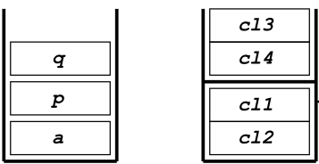
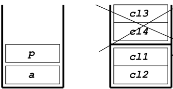
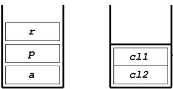
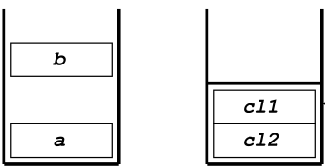
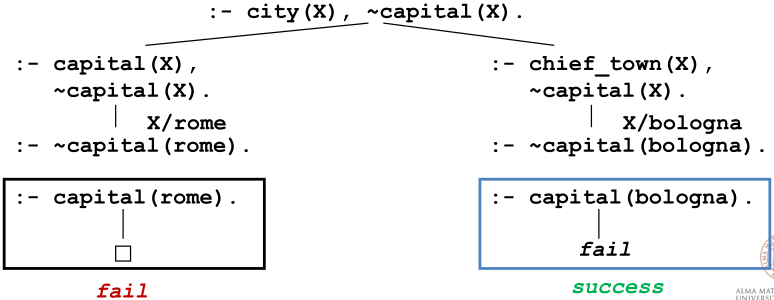

<script type="text/javascript" src="http://cdn.mathjax.org/mathjax/latest/MathJax.js?config=TeX-AMS-MML_HTMLorMML"></script>
<script type="text/x-mathjax-config"> MathJax.Hub.Config({ tex2jax: {inlineMath: [['$', '$']]}, messageStyle: "none" });</script>

# Prolog 

`A Prolog program is a set of definite Horn clauses.`

## 1. Syntax
But, what is a clause? A clause is set of different logic terms, which typically are:
- __Variables__: strings starting with a __uppercase__ letter.
- __Constants__: numbers or strings starting with a __lowercase__ letter.
- __Atomic formulas__: defined as $p(t_1, t_2, ..., t_n)$ where _p_ is a predicate.
- __Compound terms__: known also as __structures__, they are defined similarly to a traditional function $f(t_1, t_2, ..., t_n)$, where $f$ is a __function symbol__ and $t_1, t_2, ..., t_n$ are __terms__.

These definitions may seem difficult to understand. Let's consider a more intuitive approach with examples:
```prolog
X, X1, Goofey, _goofey, _x, _ % variables, the underscore symbol "_" is usually used for variables.

a, goofey, aB, 9, 135, a92 % constants.

p, p(a, f(x)), p(y), q(1) % atomic formulas.

f(a), f(g(1)), f(g(1), b(a), 27) % compound terms.
```

In addition to the key elements of __Prolog__, we have different types of clauses:
- __Fact__: ```A.``` represents a statement that is always true.
- __Rule__: ```A :- B1, B2, ..., Bn``` meaning that $A$ is true if and only if $B_1, B_2, ..., B_n$ are true.
- __Goal__: ```:- B1, B2, ..., Bn``` is a question asked to the system.

```prolog
q. % fact

p :- q, r % rule

r(z). % fact

p(x) :- q(X, g(a)) % rule
```

The comma symbol `,` represents the logical __conjuction__ $\land$. The neck symbol `:-` defines the implication $\leftarrow$, read from right to left.

## 2. Declarative and Procedural Interpretations
Every Prolog program has two main interpretations:
- __Declarative interpretation__: the declarative interpretation explains __what__ the program means. Variables within a clause are universally quantified. For each fact:
    ```prolog
    p(t1, t2, ..., tn).
    ```
    If $X_1, X_2, ..., X_n$ are the variables appearing in $t_1, t_2, ..., t_n$ the intended meaning is: `∀X1, ∀X2, ..., ∀Xn` the fact `p(t1, t2, ..., tn)` is verified.

    The meaning changes when we discuss __rules__. For each rule: 
    ```prolog
    A :- B1, B2, ..., Bn.
    ``` 
    If $Y_1, Y_2, ..., Y_m$ are the variables appearing __only__ in the body of the rule the intended meaning is: `∀X1, ∀X2, ..., ∀Xn ((∃Y1, ∃Y2, ..., ∃Ym (B1, B2, ..., Bn))) → A))`, in other words, for each variable $X_i$, if there exists variable $Y_j$ the head of the clause $A$ is verified. Let's see an example for a better understanding.
    ```prolog
    happyperson(X) :- has(X, Y), car(Y) % for each person X, if exists a car Y (anyone) that X holds, X is a happy person.
    ```
    If $X_1, X_2, ..., X_n$ are the variables appearing in __both__ the body and the head of the rule, the intended meaning is: `∀X1, ∀X2, ..., ∀Xn ∀Y1, ∀Y2, ..., ∀Ym ((B1, B2, ..., Bn) → A)`, in other words, for each variable $X_i$ and variable $Y_j$, that make the body true, the head of clause $A$ is also verified.
    ```prolog
    father(X, Y). % defining the facts of the universe described.
    mother(X, Y).

    grandfather(X, Y) :- father(X, Z), father(Z, Y) % rules heavily dependent on facts.
    grandmother(X, Y) :- mother(X, Z), mother(Z, Y)
    ```
- __Procedural interpretation__: the procedural interpretation of a Prolog program explains __how__ the system executes a goal, in contrast to the declarative interpretation, which only explains what the program means. A __procedure__ is a set of clauses with the same predicate name in the head and the same number of parameters, also called __arity__. Prolog adopts the __SLD resolution process__ and has two main charateristics:
    - It selects the __left-most__ literal in any query.
        ```prolog
        ? :- G1, G2, ..., Gn. % starting from G1 and then move on.
        ```
    - It performs __Depth-First search (DFS)__ strategy. Based on the selected search strategy, the order of the clauses in the program may greatly affect termination and, consequently, the __completeness__. DFS is a search strategy that does not guarantee completeness if the search tree contains __loopy path__. 
        ```prolog
        p :- q,r.
        p.
        q :- q,t.

        ?- p.
        loopy path
        ```
        In this toy example the fact `p.` comes after the rule `p :- q, r.`. If we ask the Prolog interpreter the query `?- p.`, the program will enter a loopy path, failing to solve it. Defining the correct order, the query will be immediately solved.
        ```prolog
        p.
        p :- q,r.
        q :- q,t.

        ?- p.
        yes
        ```
        There may exist multiple answer for a query. The way to retrieve them is easy: after getting an answer, we can force the interpreter to search for the __next solution__. Pratically, this means asking the procedure (a set of clauses with the same head and arity) to explore the remaining part of the __search tree__. In Prolog, the standard way involves using the operator `;`.
        ```prolog
        :- sister(maria, W).
        yes W = giovanni;
        yes W = annalisa;
        no
        ```
        The knowledge `giovanni, annalisa` comes from the previously defined facts.

## 3. Royal Family Exercise

## 4. Arithmetic and Math in Prolog
Arithmetic in Prolog is not a standard logical feature; it relies on special __built-in predicates__ to force its evaluation. In Prolog, an expression like `2 + 3` is just a __term__, not the numeric value `5`. For instance, the interpreter will associate the structure `+ (2, 3)` with the fact `p(2 + 3).`. 

However, the special and predefined predicate `is` forces the evaluation of any mathemical expression. Its syntax is simple: define the variable, then the predicate `is` and finally the expression to evaluate.
```prolog
T is Expr
```
We previously mentioned that Prolog is based on the SLD resolution process, which always evaluates the left-most literal. But this is not the case with `is`. The predicate `is` forces the interpreter to evaluate the right-most literal (the mathematical expression), and the final result will be associated to the variable in the next step.
```prolog
?- X is 2 + 3.
yes X = 5

?- X1 is 2+3, X2 is exp(X1), X is X1 * X2.
yes X1 = 5, X2 = 148.143, X = 742.065

?- X is Y - 1.
no
(or Instantion Fault, depending on the prolog system)
```
```prolog
?- X is 2 + 5, X is 4 + 1.
yes X = 5
```
In this example, the second goal becomes:
```prolog 
:- 5 is 4 + 1.
```
$X$ has been instantiated by the evaluation of the first goal. As before, the __order__ of the goal is very important:
```prolog
(a) :- X is 2 + 3, Y is X + 1.
(b) :- Y is X + 1, X is 2 + 3.
```
Goal `(a)` succeeds and returns `yes X = 5, Y = 6`; goal `(b)` fails due to the incorrect order defined (the variable Y is processed before the evaluation of the mathematical expression for $X$).

A term representing an expression is evaluated __only__ if it is the argument of the predicate `is`. For instance:
```prolog
p(a, 2 + 3 * 5).
p(b, 2 + 3 + 5).
q(X, Y) :- p(a, Y), X is Y.

(q(X, Y) :- p(_, Y), X is Y.) % this clause will use both procedures, achieved by the anonymus symbol.

?- q(X, Y)
yes X = 17 Y = 2 + 3 * 5 (Y=+(2, *(3, 5)))
```
Initially, the predicate `p(a, Y)` is unified with the fact `p(a, 2 + 3 * 5).`. The association defines the atomic structure `+(2 *(3, 5))`. The second step involves the evaluation of the mathematical expression `X is 2 + 3 * 5`. (why do we define the constant `a` inside the fact __p__? As we already know, a procedure is a set of clauses with same head and arity; the constant `a` allow us to distinguish which predicate we are dealing with!)

Additionally, it's also possible to compare expressions results using the standard __relational operators__, which are: `>, <, >=, =<, ==, =/=`. The last two operators are named respectvely __arithmetically equal to__ (`==`) and __arithmetically not equal to__ (`=/=`). The syntax is pretty similar to the predicate `is`:
```prolog
Expr1 REL Expr2
```
`REL` is the relational operator, `Expr1` and `Expr2` are the evaluated expressions. It's __crucial__ that both expressions are __completely instantiated__ before the comparison: otherwise the Prolog program will fail.
```prolog
p(a, 2 + 3 * 5).
p(b, 2 + 3 + 5).

comparison_values(V1, V2, equal) :- V1 == V2.
comparison_values(V1, V2, first_value_greater) :- V1 > V2.
comparison_values(V1, V2, second_value_greater) :- V1 < V2.

comparison_expressions(Type1, Type2, Result):- 
    p(Type1, Expr1),
    p(Type2, Expr2),
    Value1 is Expr1,
    Value2 is Expr2,
    comparison_values(Value1, Value2, Result).

?- comparison_expressions(a, b, R).
```
Now we have all the necessary ingredients to build __math functions__ in Prolog. Given any function $f$ with a certain arity $n$, we can implement it through a $(n + 1)$ predicate. Given the function $f:x_1, x_2, ..., x_n \rightarrow y$, it is represented by a predicate as follows: `f(X1, X2, ..., Xn, Y)`. We must always indicate the result variable `Y` within the predicate's scope so the interpreter knows exactly what the output will be.
```prolog
fatt(0, 1).
fatt(N, Y) :- 
    N > 0,
    N1 is N - 1,
    fatt(N1, Y1),
    Y is N * Y1.
```
Before moving on, it's crucial to understand its behavior and how it truly works. The example above uses the __recursion__  to solve the `factorial problem`: it begins by constructing the search tree until it reaches the leaf nodes `fact(0, 1)` and then moves towards the root node, computing the mathematical expression at each step.

## 5. Iteration and Recursion
In Prolog, __iteration__ as in `while`, `foreach` or `repeat` __does not exist__. However, we can simulate iterative behavior through __recursion__, as already done in the `factorial example`. Prolog models iteration by defining a predicate (remember: a predicate is a set of clauses, not just one!) with two essential parts:
- __Base case__: a non-recursive clause, generally a __fact__, that defines the __termination condition__ of the process.
- __Recursive case__: a rule that performs a single step of the operation and then calls itself with modified arguments, moving the process closer to the base case.
```prolog
print(1) :- write(1), nl.
print(N) :- 
    N > 1,
    write(N - 1), nl,
    N1 is N - 1,
    print(N1).
```
The `print(N)` predicate is different from the `factorial(N, Y)` predicate; where the interpreter completed the search tree __before__ computing the expressions, here it immediately shows the results through the `write` predicate. 

Even though any well-structured recusion works fine, a spefic type is more desirable for efficiency: __tail recursion__. A function is __tail-recursive__ if the recursive call is the __most external call__ in its definition. There are many cases where a non-tail recursion can be re-written as a tail recursion.
```prolog
fatt1(N, Y):- fatt1(N, 1, 1, Y).
fatt1(N, M, ACC, ACC) :- M > N.
fatt1(N, M, ACCin, ACCout) :- 
    ACCtemp is ACCin * M,
    M1 is M + 1,
    fatt1(N, M1, ACCtemp, Accout).
```
The factorial is computed using an __accumulator__. An accumulator is an extra argument passed to the predicate, which holds the running or partial result of the computation at each step. The main advantage is that the evaluation of the mathematical expression is done __before__ the recursive call, avoiding __backtracking__ and mantaining a constant __space complexity__.

## 6. Iteration Exercises

## 7. Lists
Lists are one of the most fundamental and widely used data structures in any programming languages. In Prolog, lists are terms built upon the special atom `[ ]`, called __empty list__, and the __constructor operator__ `.`. A list is recursively defined as:
- The __empty list__, `[ ]`.
- A non-empty list consisting of a __head__ and a __tail__, where the tail is itself a list, `.(T, List)`.
<div align="center">
    <table>
        <head>
            <th>Standard notation</th>
            <th>Head-Tail notation</th>
        </head>
        <body>
            <tr align="center">
                <td>[a]</td>
                <td>.(a, [])</td>
            </tr>
            <tr align="center">
                <td>[a, b]</td>
                <td>.(a, .(b, []))</td>
            </tr>
            <tr align="center">
                <td>[a, b, c]</td>
                <td>.(a, .(b, .(c, [])))</td>
            </tr>
        </body>
    </table>
</div>

Since the __head-tail notation__ might be quite difficult to use, the term `.(T, List)` can be also represented as `[T | List]`. Once again, the __head__ is `T` and the __tail__ is `List`.
<div align="center">
    <table>
        <head>
            <th>Standard notation</th>
            <th>Head-Tail notation</th>
        </head>
        <body>
            <tr align="center">
                <td>[a]</td>
                <td>[a | [ ]]</td>
            </tr>
            <tr align="center">
                <td>[a, b]</td>
                <td>[a | [b | [ ]]]</td>
            </tr>
            <tr align="center">
                <td>[a, b, c]</td>
                <td>[a | [b | [c | [ ]]]]</td>
            </tr>
        </body>
    </table>
</div>

Even in this case, the recursive notation `[T | List]` is rather __verbose__. Therefore, we can use a more simplified syntax, such as `[a, b, c]` for the term `[a | [b | [c | [ ]]]]`. 

The greatest power about lists in Prolog comes from the easy way to manipulate them using an __unification algorithm__. This provides a complete method for accessing and deconstructing list content.
```prolog
p([1, 2, 3, 4, 5, 6, 7, 8, 9]).

:- p(X).
yes X = [1, 2, 3, 4, 5, 6, 7, 8, 9]

:- p([X|Y]).
yes X = 1 Y = [2, 3, 4, 5, 6, 7, 8, 9]

:- p([X,Y|Z]).
yes X = 1 Y = 2 Z = [3, 4, 5, 6, 7, 8, 9]

:- p([_|X]).
yes X = [2, 3, 4, 5, 6, 7, 8, 9]
```
This code snippet represents some examples about list unification processes. In particular, it's important to focus on the last predicate shown: we used the __anonymus symbol__ `_` to create a new list containing all the previous values __except__ the first one. The anonymus symbol allows us to "ignore" the first value of the current data structure.

List operations are inherently recursive, using the `[Head|Tail]` data structure to process one element at a time until the base case `[]` (empty list) is reached. Many list-related predicates can be written using this rule as the main principle.

1. __isList__

    `isList` checks if an argument is a list. The base case is the empty list `[]`, and the recursive part checks if the tail is also a list. 
    ``` prolog
    isList([]).
    isList([X|Tail]) :- isList(Tail).

    :- isList([1, 2, 3]).
    yes 

    :- isList([a|b]).
    no
    ```

2. __member__

    `member` checks if an element $X$ is in a given list. The base case is when the element coincides with the head of the list, and the recursive case checks if the element is in the tail of the list.
    ```prolog
    member(X, [X| ]).
    member(X, [_|Tail]) :- member(X, Tail).

    :- member(1, [1, 2, 3]).
    yes 

    :- member(4, [1, 2, 3]).
    no

    :- member(X, [1, 2, 3]).
    yes X = 1;
        X = 2:
        X = 3;
    no
    ```

3. __length__

    `length` defines the size of the list. It takes a list as first argument and the number of elements contained in the list as the second argument.
    ```prolog, 0).
], N) :- as the second argument 
        length(Tail, NT),
        N is NT + 1.

    :- length([1, 2, 3], 3).
    yes

    :- length([1, 2, 3], Result).
    yes Result = 3
    ```

4. __append__

    `append` takes three lists as arguments: the first two are the actual, instantiated lists, and the third argument is the list obtained by concatenating the first two. This is a highly reversible and powerful tool. 
    
    1. If the first list is empty, the result is the second list.
    2. If the first list has a __head__, we keep it and recursively append the rest of the first list (the __tail__) to the second list.

    ```prolog 
    append([], L1, L1).
    append([H | Rest1], L2, [H | NewTail]) :-
        append(Rest1, L2, NewTail).

    :- append([1, 2], [3, 4, 5], L).
    yes

    L = [1, 2, 3, 4, 5]
    :- append([1, 2], L2, [1, 2, 4, 5]).
    yes

    L2 = [4, 5]
    :- append([1, 3], [2, 4], [1, 2, 3, 4]).
    no
    ```

5. __deleteFirstOccurrence__

    `deleteFirstOccurrence` takes an element and a list as its first and second arguments, respectvely, and the third argument is the list without the first occurrence of the element.

    ```prolog
    deleteFirstOccurence(El, [], []).
    deleteFirstOccurence(El, [El|T], T).
    deleteFirstOccurence(El, [H|T], [H|T1]) :-
        deleteFirstOccurence(El, T, T1).
    ```

6. __deleteAllOccurrences__

    `deleteAllOccurrences` is a predicate that takes an element and a list as its first and second arguments; the third parameter is the list without all the terms that unify with the element.

    ```prolog
    deleteAllOccurences(El, [], []).
    deleteAllOccurences(El, [El|T], Result):- deleteAllOccurrences(El, T, Result).
    deleteAllOccurences(El, [H|T], [H|T1]) :- deleteAllOccurences(El, T, T1).
    ```

7. __reverse__ 

    `reverse` takes two lists as arguments, returning a list that is the reverse of the second list given (the typical usage is `reverse(List, ReverseList)`).

    ```prolog
    reverse([],[]).
    reverse([H|T], Result) :-
        reverse(T, Partial),
        append(Partial, [H], Result).

    :- reverse([], []).
        yes

    :- reverse([1, 2], Lr).
        yes Lr = [2, 1]

    :- reverse(L, [2, 1]).
        yes L = [1, 2]
    ```

## 8. List Exercises

## 9. The CUT
The __cut operator__ `!` is a predefined predicate that allows interference with and control over the execution process of a Prolog program. It has no logic meaning or declarative semantic, but it heavily affects the execution process.

Any execution process is built upon two stacks:

- __Execution stack__. Contains the activation records of the predicates.
- __Backtracking stack__. Contains the set of open __choice points__. A choice point marks an alternate clause that can be explored if the current path fails (similar to any search strategy seen so far, like how in A*, we keep the set of node to explore in the fringe).

When a goal succeeds, Prolog might still have open choice points. When a goal fails, Prolog backtracks to the most recent choice point to try an alternative branch.

### Example
```prolog
(cl1) a :- p, b.
(cl2) a :- r.
(cl3) p :- q.
(cl4) p :- r.
(cl5) r.
```


In the execution stack, we place the current goal A. In the backtracking stack, we place the references to all the clauses that match our current goal A. 


In the next step, our current goal will be $P$, as we can observe from the rule `a :- p, q`, and again inside the backtracking stack, we will put all the clauses that match the current goal `p`. We always choose the rule following the syntactical order, so `p :- q` comes before `p :- r`.



Following this behavior, our next goal will be $Q$. Again, we put it in the execution stack, but unfortunately, it will fail because it's not defined inside our program. So, the interpreter will select the next open choice point. 



By performing backtracking, the interpreter knows there is another clause corresponding to $P$, so it will place the fact `r.` in the execution stack. $P$ is true if $R$ is true. Looking at the program, we see that $R$ is a fact. $P$ succeeds, so we move to the second part of the $A$ clause, `a :- p, b.`. Finally, $R$ and $P$ are removed from the execution stack.



Now we must focus on $B$. However, $B$ is not defined inside our Prolog program, it will certainly fail.



Since there is no unification with the $B$ part of the clause, the resolution of the overall clause will fail.

##

The main idea behind the __CUT__ operator is to interfere with the backtracking stack. Whenever we execute the cut, we __throw away__ some alternatives that are stored in the backtracking stack. Doing this makes the execution deterministic because we choose only one branch and we stay within that single branch of the search tree.

There are advantages and disadvanteges about using the __CUT__ operator:
- __Advantages__: greater __efficiency__ and lower __memory__ usage.
- __Disadvantages__: we lose __completeness__, as more alternatives define more possible solutions (it's not the same as Alpha-Beta pruning).

### Effect of the CUT operator
Given the clause:

``` prolog
p :- q1, q2, ..., qi, !, qi+1, qi+2, qn.
```
The real meaning is that all choices made about proving the predicate `p` and literals `q1` up to `qi` are made __final__; they cannot be backtracked anymore. All alternative choices for their predicates are discarded.

If the remaining part of the clause fails, the literals after the cut operator $q_{i+1}, q_{i+2}, ..., q_n$, the entire rule will fail.

The real effect is that CUT operator __removes branches of the search tree__. 
```prolog
a(X,Y) :- b(X), !, c(Y).
a(0,0).
b(1).
b(2).
c(1).
c(2).

:- a(X,Y).
yes X=1 Y=1;
    X=1 Y=2;
no
```
As we can see from the example, the interpreter will always take the first fact of `b`, which is `b(1).`. The alternatives `b(2)` and `a(0, 0).` are simply ignored (remember: the CUT operator affects the predicates defined __before__ the cut, but also __alternative clauses__ for the predicate in which it appears!). 

Why do we need the CUT operator? It may seem like a counterintuitive tool since it doesn't consider all possibilities and does not guarantee completeness. The real answer is that sometimes using the CUT operator allows us to __simplify__ our Prolog program.

### Example
```prolog
p(X) :- q(X), !, r(X).
q(1).
q(2).
r(2).

:- p(X).
no
```
This example fails because the only match for `q(X)` that Prolog finds first is 1. The variable $X$ becomes 1. Since the fact is `r(2).`, the predicate `r` does not have any match for 1, so the query with $X = 1$ fails. Without the cut operator, or by defining `q(2).` before `q(1).`, the query $X = 2$ would succeed after backtracking.

The first use of the CUT operator is to achieve __mutually exclusive conditions__ between two clauses. In any programming languages, we would typically write the mutual exclusive condition as:
```python
if a then b else c
```
Doing that in prolog is simply:
```prolog
p(x) :- a(X), !, b.
p(x) :- c.
```

##

### Filtering Example
__Problem__: `Write a predicate that receives a list of integers, and returns a new list containing only positive numbers.`

```prolog
filter([], []).
filter([H|T], [H|Rest]) :- H > 0, filter(T, Rest).
filter([H|T], Rest) :- H =< 0, filter(T, Rest).
```
1. If the list is empty, an empty list is returned.
2. If the first element of the list, $H$, is positive, a new list is returned, consisting of $H$ and the $\textit{Rest}$, where $\textit{Rest}$ is obtained by the recursive call `filter` over the $T$ part.
3. We throw away $H$ if its value is less than or equal to 0.

However, the third clause contains a redudant condition ($H =< 0$). We already know from the second clause that if the condition $H > 0$ is not met, the remaining condition must be $H \le 0$.

In a declarative way, we have to `pay this price` if we want mutual exclusivity without the CUT.

```prolog
filter([], []).
filter([H|T], [H|Rest]) :- H>0, !, filter(T, Rest).
filter([_|T], Rest) :- filter(T, Rest).
```
Here, we are saying that if the condition in the second clause succeeds, the right most part of the clause will __never__ be reached because of the CUT. We have to imagine that the branch of the search tree is already set up with the two predicates `filter([H|T], [H|Rest])` and `filter([_|T], Rest)`. If the first one succeeds, the second predicate is removed by the CUT operator.

If the condition $H > 0$ in the second clause fails, the CUT operator is never executed. The interpreter will start to backtrack and choose the next choice point, which is `filter([_|T], Rest)`. For doing this, we must define the recursive call in third part of the first rule, otherwise the interpreter will never choose the next choice point.

##

## 10. Negation
There is a key point in Prolog that we haven't discussed yet: Prolog is based on own clauses, which are a subset of First Order Logic. We don't assume the whole scope of First Order Logic, we focus on a smaller fragment of it. However, this fragment allow us to have the same expressive power, even though some things cannot be written in Prolog.

As the definition states, Prolog allows only definite clauses, which __cannot contain negative literals__. The standard SLD resolution process is designed to derive __positive__ informations and is incapable to derive __negative__ information. If we provide a simple knowledge base such as:
```prolog
person(mary).
person(caterina).
person(annalisa).

dog(meave).
```
Intuitively, we can derive that `meave` is not a person. But what about Prolog? Is it capable of defining if `meave` is __NOT__ a person? From the previous knowledge base, Prolog cannot derive that `meave` is not a person since it is not explicitly written inside the program

### Closed World Assumption
The __Closed World Assumption__ (our knowledge is closed with the respect to the World) is one of the main concept about __Database Theory__ that formalizes the notion that `if it's not recorded, it's false`.

Back to the previous example:
```prolog
person(mary).
person(caterina).
person(annalisa).

dog(meave).
```
Can we prove that `mary` is a dog? The real answer is __NO__, but using CWA, we could infer $$\neg dog(mary).$$

In practical terms, the Closed World Assumption might be either a good or a bad way to model our world; it relies expecially about the concepts we are expressing. In Prolog  the Closed World Assumption has been chosen as the primary way to treat the __knowledge base__. 

### CWA Example
```prolog
capital(rome).
city(X) :- capital(X).
city(bologna).
```
From this instance, we know for sure that if $X$ is a `capital`, it is also a `city`.

Using the Closed World Assumption, we can infer $$\neg capital(bologna)$$ since we don't have this kind of information in our knowledge base. The interpreter will try to solve the query `:- capital(bologna)`, it will fail, allowing us to derive that `bologna` is not a capital. 

By the way, the Closed World Assumption is __non-monotonic__: adding new axioms to the program might change the answer `capital(bologna)`.

Additionally, First Order Logic is __undecidable__: if a formula _A_  is not a logical consequence of the program _P_, the proof procedure is __not guaranteed to terminate in a finite time__.

##

### Example
```prolog
city(rome) :- city(rome).
city(bologna).
```
The SLD resolution process cannot prove in a finite time that `city(rome)` predicate is not a logical consequence of our program. Since SLD uses the Depth-First strategy to explore the state space, the interpreter will end up in a __loopy path__ because it tries to solve the goal using the recursive rule.

Since __CWA__ sometimes fails to prove that a predicate is not a logical consequence of our program, we restrict the Closed World Assumption to those atoms whose proof terminates in a finite time.

This restriction is called __Negation as Failure__.

##

### Negation as Failure
Prolog adopts a safer rule called __Negation as Failure (NAF)__ to address the termination problem of CWA. 
- __Principle__: NAF derives the negation only of atoms whose proof fails in a __finite time__.
- __Formalism__: given _FF(P)_, the set of atoms which proofs fail in a finite time, the NAF rule is: $NF(P) = \{\neg A | A \in FF(P)\}$.

Therefore, we are not supporting general negation and the Closed World Assumption; instead, we are restricting them to a further smaller set.

To handle goals containing negative literals, such as `~A`, SLD resolution is extended to __SLDNF__, the same resolution process with Negation as Failure. Let $\textit{:-} L_1, ..., L_m$ be the goal, where $L_1, ..., L_m$ are literals (atoms or negation of atoms). Since it is only an extension of the previous resolution process, an SLDNF step is defined as follows:
1. Do not select any negative literal $L_i$ if it is __not ground__ (meaning completely instantiated, with no variables).
2. If the selected literal $L_i$ is positive, then apply a normal SLD resolution step.
3. If is a negative literal, `~A` with $A$ ground, and $A$ fails in finite time, then $L_i$ succeeds, and the new resolvent is: 
$L_1, ..., L_{i - 1}, L_{i + 1}, ..., L_m$

The selection of ground negative literals is necessary to ensure __completeness__ and __correctness__ of SLDNF rule.

### SLDNF Example
```prolog
capital(rome).
chief_town(bologna)
city(X):- capital(X).
city(X):- chief_town(X).

:- city(X), ~capital(X).
```


Here, we are asking if exists $X$ such that is a `city` but not a `capital`. The SLD search tree is composed as follows:

The interpreter tries to solve the query by the first branch. The positive literal `city(X)` unifies with `city(rome)` via `capital(rome)`. $X$ is instantiated to `rome`. The negative literal becomes $\neg \textit{capital(rome)}$, which fails since `capital(rome)` is true. It keeps going by backtracking, and then it selects the second branch, the right-most one. The positive literal `city(X)` unifies with `city(bologna)` via `chief_town(bologna)`. $X$ is instatiated to `bologna`. It tries to solve the negative literal $\neg \textit{capital(bologna)}$. Since `capital(bologna)` fails in finite time, the negative literal $\neg \textit{capital(bologna)}$ succeeds. We have just found an atom `bologna` that is a city but not a capital.

Prolog does not use exactly this extension to resolve negative literals; it selects always the left-most literal, __without checking if it is ground__, so if the literal is completely instatiated. 

##

### Example
```prolog
capital(rome).
chief_town(bologna)
city(X):- capital(X).
city(X):- chief_town(X).

:- ~capital(X), city(X).
```
In the example, we have just switched the subgoals of the query. However, this change has a heavily impact on the execution. Given this knowledge base, the interpreter will always return __false__. 

The main problem lies in the meaning of the quantifiers of variables appearing in negative literals. The intended meaning of $\neg \textit{capital(bologna)}$ is: "does exist an $X$ such that $X$ is not a capital?" Given the knowledge base, it does exist an entity that is not a capital. 
$$F = \exists X \neg capital(X).$$
Instead, in Prolog SLDNF, we are looking for a proof for $\textit{capital(X)}$
$$\textit{:-} capital(X)$$

with explicit quantifiers, it becomes:
$$F = \exists X capital(X).$$

Then, the result is negated:
$$F = \neg(\exists X capital(X))$$

and according to syntactic rules, the previous definition is equal to:
$$F = \forall X(\neg capital(X)).$$

In summary, if there is a $X$ that is a capital, the proof $F$ will always fail. The failure is due to the unsafe order; if the subgoals were switched, the query would succeed. Another final peculiarity is that Prolog tries to solve the query even though the negative literal is __not ground__, violating the __safe rule__ of SLDNF resolution process.