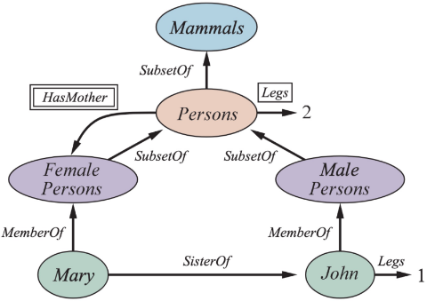
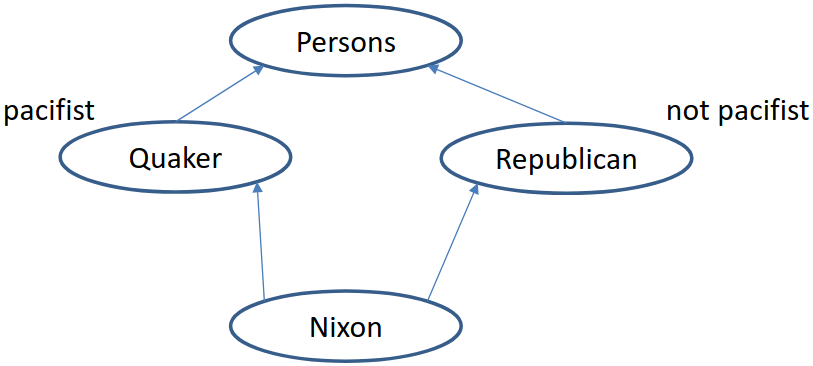

<script type="text/javascript" src="http://cdn.mathjax.org/mathjax/latest/MathJax.js?config=TeX-AMS-MML_HTMLorMML"></script>
<script type="text/x-mathjax-config"> MathJax.Hub.Config({ tex2jax: {inlineMath: [['$', '$']]}, messageStyle: "none" });</script>

# Frames and Semantic Network
`One way to represent and reason about categories and objects`.

## 1. Introduction
Done the **upper ontologies**, during the 60s and 70s, reasearchers start to reason about the way to represent all this stuff. As we already know, **categories** are a powerful mechanism for describing the knowledge representation. 

The basic idea is to define categories in a **computable form**. First Order Logic is a great tool for describing knowledge, however, sometimes, it is not the easiest way for this goal. Historically, the approach that has been decided in knowledge representation field is the **semantic network**.

## 2. Semantic Network
Semantic networks provide a graphical way for visualizing a knowledge base. Generally, any network, even the easiest one, has two main representations:
- **Boxes**, used to determine either objects and categories.
- **Links**, used to describe the relationships between boxes.

In particular, at the beginning, there was some misunderstandings about the **nature** of the links, in other words, about their real meaning.

### Example
Given the following example, we can observe some peculiarities.

<div align = "center">
    
</div>

Boxes are categories and objects; in this case, we distinguish:
- `Mammals`, `Persons`, `FemalePersons` and `MalePersons` as **categories**.
- `Mary` and `John` as **objects**.

Before moving on, the figure shows us several meanings of the relationships, as:
- 1<sup>st</sup> *MemberOf* is a membership link, `Mary` is an entity of `FemalePersons` category.
- 2<sup>nd</sup> every female person is an entity of the `Persons` category; we derive that `FemalePersons` is a subclass of `Persons`.
- 3<sup>rd</sup> the property *SisterOf* between `Mary` and `John` is a shortcut to describe a more complex logical axiom: `Mary` and `John` are siblings if and only if they share at least one parent.
- 4<sup>th</sup> `Legs = 1` is a property related only to `John`. Deafault properties can be assigned directly to the objects, like an overriding method.
- 5<sup>th</sup> every entity of `Persons` category has a mother that is a female person. Formally, the relationship would be:
  $$\forall x,x \in Persons \rightarrow (\forall y \operatorname{HasMother}(x,y) \rightarrow y \in FemalePersons)$$

#

Semantic networks are a very easy way to describe our knowledge; however, we are dealing within a syntax that any time has a different meaning: from the previous example, we have four different types of links and each of them has the same representation. This ambiguity could cause several problems, we must define a more formal way.

What it's nice about these network representations is that we can easily reason about **inheritance** and its properties. 

### Example
For instance, given this query:

`how many legs does Mary have?`

we can derive this property simply go backword through the network, until we arrive to `Persons` category, where we learn that each instance of the category has 2 `Legs`. Therefore, we can derive some notions even though their are not directly attached to the box object.

#

By the way, things seem to be more difficult when we have to deal with **multiple inheritance**.

<div align = "center">
    
</div>

This chart is called the *diamond problem*: `Nixon` is an instance of two categories at the same time. Belonging to two subclasses at the same time could cause inconsistencies between properties of the instance described.

How do we have to interpret the `Nixon` object? Is it a pacifist or a not-pacifist? Can it be both? We have a sort of incoherence between properties, and from an inconsistent set of logical axioms we can retrieve any possible truth.

Many semantic networks systems allow to attach a **call** to a special procedure; any category or object could have a *piece of program* to execute.

## 3. Frames
The faculty to attach a call to a special procedure, by a category or an object, bring us to the notion of **frame**. A frame is another way to present a knowledge base; we can divided a network by a set of single frames.

`Definition` \
A frame is a piece of knowledge that describes an object in terms of its properties.

The frame approach can be viewed as an attempt to integrate together declarative and procedural knowledge.

Every frame has:
- Unique name.
- Special representation of properties by couples of *slot/filler*.

### Example

```
(tripLeg123 
    <:Instance-of TripLeg>
    <:Destination toronto
    ...
)

(toronto 
    <:Instance-of City>
    <:Province ontario>
    <:Population 4.5M>
    ...
)
```

`toronto` is an entity of the `City` category: `Province` and `Population` are the **slots** of the properties representation and `ontario`, `4.5M` are the **fillers**.

#

Slots can contain additional information about the fillers, named **facets**, such as:
- Default value.
- Allowed range.
- Type.

More interestingly, fillers can take the form of procedural attachments. Therefore, fillers can be **calls** of pieces of code. They are divided into:
- `if-added call`, used for adding value to a slot.
- `if-removed call`, used for removing value from a slot.
- `if-needed call`, used for looking for the value of a slot.

### Example

```
(toronto 
    <:Instance-of City>
    <:Province ontario>
    <:Population [IF-NEEDED QueryPopulationDB]>
    ...
)
```